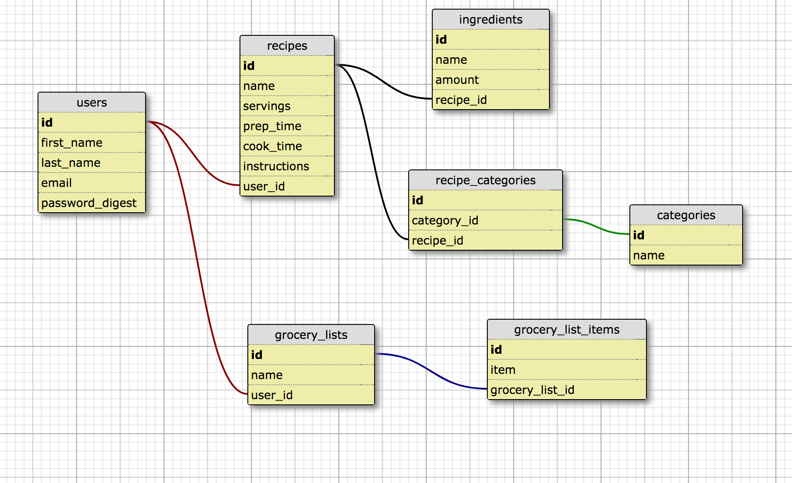

# README

## Welcome to Sous Chef
Sous Chef is a recipe manger and grocery building app where you can store all your recipes in one place. From your list of recipes, you can create a grocery list from selected recipes.

The app is built with a mainly rails API and then react (using the rails-react gem) and some jQuery on the client side.

production: https://sous-chef18.herokuapp.com/

login to production with existing user:

  email: barb@aol.com

  password: 1234

### Setup

ruby `2.3.0`
rails `5.0.4`

git clone `git@github.com:caward12/sous_chef.git`
cd into `sous_chef`
run  `bundle`

### Schema

#### Running Tests
Parts of the test suit uses selenium and is set up to run on a very specific version of Firefox - version 46, which you can download [here](https://www.softexia.com/windows/web-browsers/firefox-46)

run  `rspec` to run entire test suite

#### Accessibility
This project considered accessibility for users in the following ways:
- color palette: There is one main accent color which helps those with color blindness still see some contrast.
- tabIndex: tabIndex was used throughout the project to allow users with mobility issues tab through the pages.
- font-size: font size was increased to make it easier to read. 

### Api endpoints
There are several api endpoints in this project:

`GET /api/v1/recipes` returns all recipes for current_user
`POST /api/v1/recipes` creates a new recipe given at least a name param
`PUT /api/v1/recipes/:id` updates a recipe with name, servings, prep_time, cook_time and/or instruction params

`GET /api/v1/categories` returns all categories created by current_user
`POST /api/v1/categories` creates a new category for recipe_id param
`PUT /api/v1/categories/:id` updates a category name

`POST /api/v1/ingredients` creates ingredients for a recipe_id param
`PUT /api/v1/ingredients/:id` updates an ingredient

`POST /api/v1/recipe_categories` creates a recipe_category record for existing category and new recipe
`DELETE /api/v1/recipe_categories`deletes a recipe_category record

`POST /api/v1/grocery_lists` creates a grocery list and associated grocery_list_items with recipe id(s) passed in
